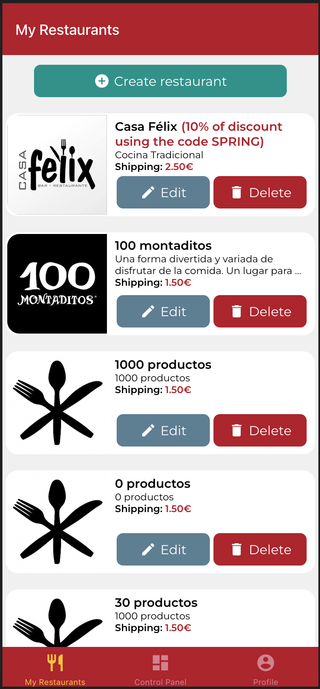

# IISSI2: Evaluación individual laboratorio 2022-2023

## Preparación del entorno

Windows:

* Abra un terminal y ejecute el comando `npm run install:all:win`.

Linux/MacOS:

* Abra un terminal y ejecute el comando `npm run install:all:bash`.

## Ejecución y depuración

* Para **ejecutar el backend**, abra un terminal y ejecute el comando `npm run start:backend`.

* Para **ejecutar el frontend**, abra un nuevo terminal y ejecute el comando `npm run start:frontend`.

* Para **depurar el backend**, asegúrese de que **NO** existe una instancia en ejecución, pulse en el botón `Run and Debug` de la barra lateral, seleccione `Debug Backend` en la lista desplegable, y pulse el botón de *Play*.

* Para **depurar el frontend**, asegúrese de que **EXISTE** una instancia en ejecución, pulse en el botón `Run and Debug` de la barra lateral, seleccione `Debug Frontend` en la lista desplegable, y pulse el botón de *Play*.

* Para **rehacer las migraciones y seeders del backend**, abra un terminal y ejecute el comando `npm run migrate:backend`.

## Enunciado - Ordenación de productos por precio

Realice las modificaciones que considere necesarias, tanto en backend como en frontend, para satisfacer los nuevos requisitos que a continuación se describen.

Se desea ofrecer a los propietarios que los productos de sus restaurantes aparezcan ordenados según el campo `order` de la entidad Producto o según el campo `price` del producto, y que puedan determinar cual será el orden predeterminado en cada restaurante, de manera que cuando se listen los productos aparezcan siempre según el orden que haya decidido.

Recuerde que actualmente los productos se muestran en la pantalla de detalle del restaurante y el backend los devuelve siempre ordenados según el campo `order`. Por defecto, cada restaurante ordenará sus productos según el mencionado campo `order`.

Implemente los cambios necesarios en Backend y Frontend para incluir dicha funcionalidad. Se espera que el Frontend siga un diseño como el que se muestra en las siguientes capturas.

Nótese que **no** se pide modificación de las pantallas de creación o edición de restaurante.



**NOTA**: Puede usar el siguiente icono para el nuevo botón:

```JSX
<MaterialCommunityIcons name='sort' color={'white'} size={20} />
```

y los siguientes colores de fondo: `brandSuccess` o `brandSuccessDisabled`.

## Procedimiento para la entrega

1. Elimine las carpetas node_modules de los proyectos de backend y frontend y la carpeta .expo del proyecto frontend.
1. Cree un zip que incluya ambos proyectos. **OJO: Compruebe que el zip resultante no es el mismo que descargó y que por lo tanto incluye sus soluciones**
1. Avise a su profesor antes de realizar el envío.
1. Cuando tenga el visto bueno de su profesor, envíe el fichero resultante a través de enseñanza virtual.
