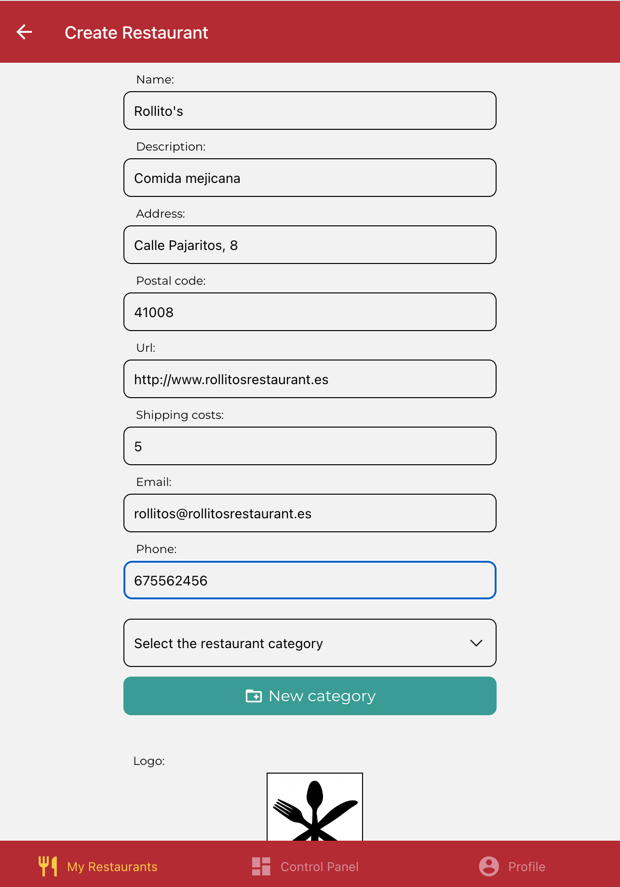
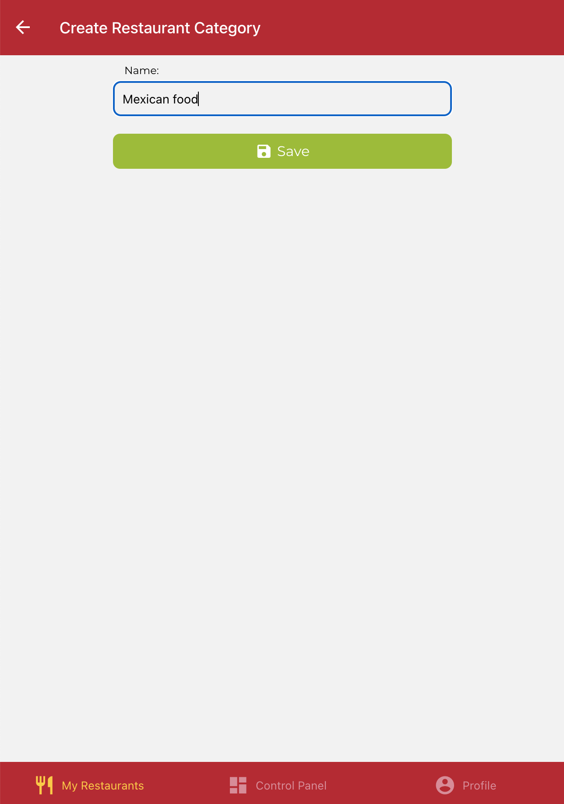
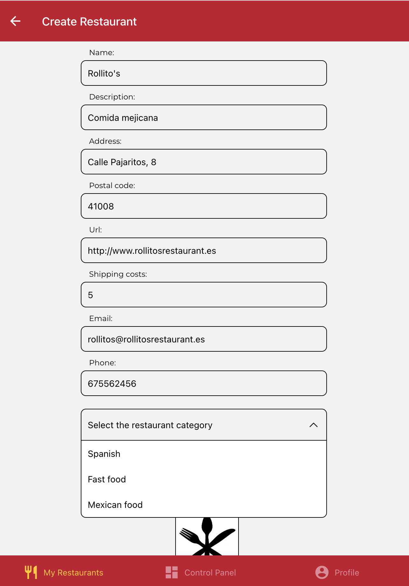
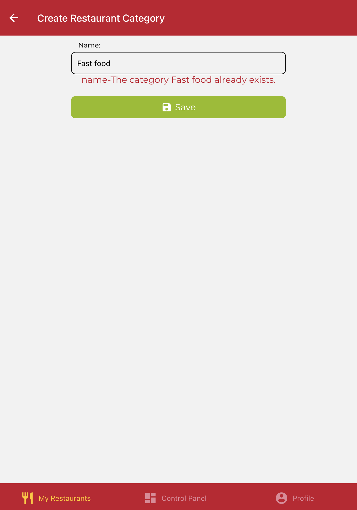

# IISSI2: Evaluación individual laboratorio 2022-2023

## Preparación del entorno

Windows:

* Abra un terminal y ejecute el comando `npm run install:all:win`.

Linux/MacOS:

* Abra un terminal y ejecute el comando `npm run install:all:bash`.

## Ejecución y depuración

* Para **ejecutar el backend**, abra un terminal y ejecute el comando `npm run start:backend`.

* Para **ejecutar el frontend**, abra un nuevo terminal y ejecute el comando `npm run start:frontend`.

* Para **depurar el backend**, asegúrese de que **NO** existe una instancia en ejecución, pulse en el botón `Run and Debug` de la barra lateral, seleccione `Debug Backend` en la lista desplegable, y pulse el botón de *Play*.

* Para **depurar el frontend**, asegúrese de que **EXISTE** una instancia en ejecución, pulse en el botón `Run and Debug` de la barra lateral, seleccione `Debug Frontend` en la lista desplegable, y pulse el botón de *Play*.

* Para **rehacer las migraciones y seeders del backend**, abra un terminal y ejecute el comando `npm run migrate:backend`.

## Enunciado - Creación de categorías de restaurantes personalizadas

Realice las modificaciones que considere necesarias, tanto en backend como en frontend, para satisfacer los nuevos requisitos que a continuación se describen.

Se desea permitir a los dueños de restaurantes crear sus propias categorías de restaurantes. Para ello, en la pantalla de creación de restaurantes se incluirá un botón para acceder a una nueva pantalla que permitirá introducir un nuevo nombre de categoría de restaurante (ver capturas). Puede usar este icono para el botón:

```JSX
<MaterialCommunityIcons name='folder-plus-outline' color={'white'} size={20} />
```

Al volver a la pantalla de creación de restaurantes tras introducir la nueva categoría, dicha categoría debe estar disponible en la lista desplegable de categorías de restaurantes.

No se debe permitir la creación de una categoría que ya existiera. En dicho caso, el Backend debe responder con un error que será visualizado en la pantalla de creación de categorías de restaurantes al pulsar el botón de submit. Además, el tamaño máximo para los nombres de las categorías de restaurante será de 50 caracteres. Esta restricción debe comprobarse tanto a nivel de formulario en el Frontend como a nivel de Backend.

<div style="text-align: center">


</div>

<div style="text-align: center">


</div>


## Procedimiento para la entrega

1. Elimine las carpetas node_modules de los proyectos de backend y frontend y la carpeta .expo del proyecto frontend.
1. Cree un zip que incluya ambos proyectos. **OJO: Compruebe que el zip resultante no es el mismo que descargó y que por lo tanto incluye sus soluciones**
1. Avise a su profesor antes de realizar el envío.
1. Cuando tenga el visto bueno de su profesor, envíe el fichero resultante a través de enseñanza virtual.
