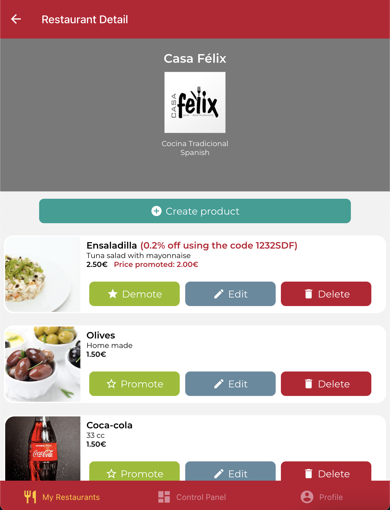
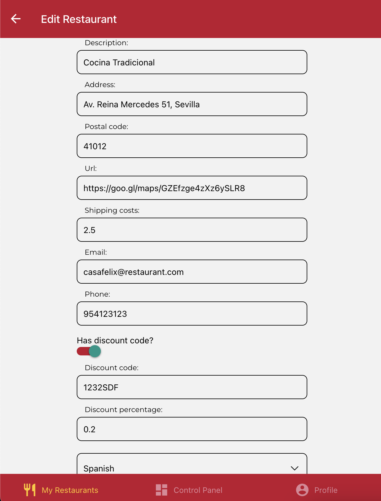
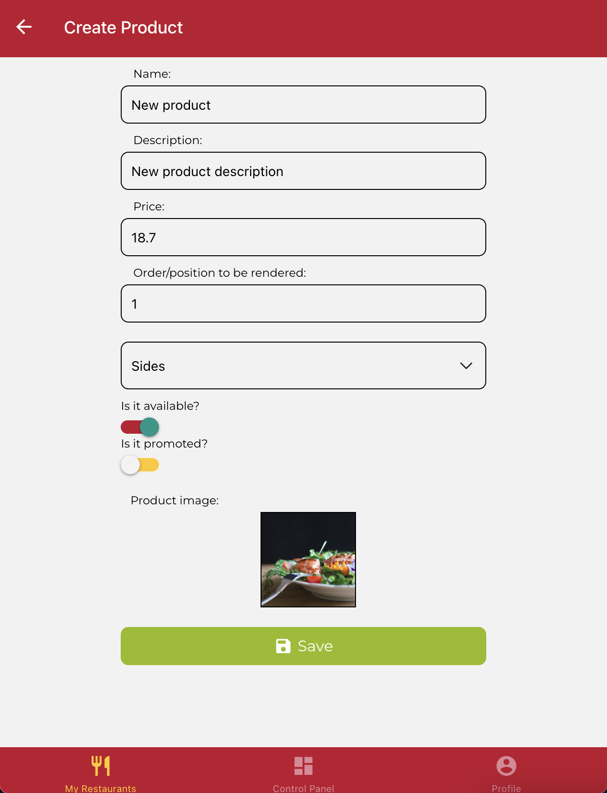

# DeliverUS-Owner Monorepo

## Introducción

Este repositorio incluye el backend completo (carpeta `DeliverUS-Backend`) y el frontend de owner (carpeta `DeliverUS-Frontend-Owner`). Servirá como base para los exámenes de convocatoria de la asignatura.

## Preparación del entorno

Windows:

* Abra un terminal y ejecute el comando `npm run install:all:win`.

Linux/MacOS:

* Abra un terminal y ejecute el comando `npm run install:all:bash`.

## Ejecución y depuración

* Para **ejecutar el backend**, abra un terminal y ejecute el comando `npm run start:backend`.

* Para **ejecutar el frontend**, abra un nuevo terminal y ejecute el comando `npm run start:frontend`.

* Para **depurar el backend**, asegúrese de que **NO** existe una instancia en ejecución, pulse en el botón `Run and Debug` de la barra lateral, seleccione `Debug Backend` en la lista desplegable, y pulse el botón de *Play*.

* Para **depurar el frontend**, asegúrese de que **EXISTE** una instancia en ejecución, pulse en el botón `Run and Debug` de la barra lateral, seleccione `Debug Frontend` en la lista desplegable, y pulse el botón de *Play*.

* Para **rehacer las migraciones y seeders del backend**, abra un terminal y ejecute el comando `npm run migrate:backend`.

## Enunciado

La empresa ha decidido ofrecer a los propietarios la posibilidad de cambiar manualmente el estado de sus restaurantes abiertos (`online` u `offline`). En caso de que un restaurante tenga un estado `online` u `offline`, la nueva funcionalidad proporcionaría un botón para alternar entre ambos estados. De lo contrario, dicho botón no debe estar disponible.

Tenga en cuenta que cualquier restaurante nuevo se almacena inicialmente como `offline` de forma predeterminada. Solo los restaurantes offline pueden estar en línea y viceversa. Por otro lado, si un restaurante alcanza un estado de `cerrado` o `cerrado temporalmente`, la posibilidad de cambio manual no estará disponible y su uso estará prohibido por el sistema. Además, tenga en cuenta que un restaurante tampoco podrá cambiar su estado si tiene pedidos con un valor nulo en `deliveredAt`.

La nueva funcionalidad también implicará proporcionar la lista de restaurantes propiedad del usuario ordenados por estado (ascendentemente) y, para el mismo estado, por nombre. Finalmente, el estado de cada restaurante debe ser visible (consulte las imágenes a continuación).

El sistema debe mostrar la lista de restaurantes por propietario como se muestra en las siguientes capturas de pantalla:

Le pedimos que implemente los cambios necesarios en el backend y frontend para incluir la funcionalidad requerida.
